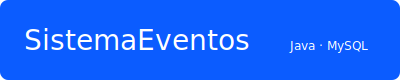

## SistemaEventos — Servicio Web

Proyecto final de la asignatura **Desarrollo de Servicios Web II (DSWII)** — sistema para gestionar eventos, locales, participantes y proveedores con **Java** y **MySQL**.



  

### 🌐 SistemaEventos — Servicio Web (Java · MySQL)

---

Proyecto final de la asignatura **Desarrollo de Servicios Web II (DSWII)**. Sistema para gestionar eventos, locales, participantes y proveedores.

El proyecto expone endpoints REST-like implementados con servlets para consumo sencillo. La persistencia usa **MySQL** y la conectividad JDBC está en `src/main/java/miLib/ConexionBDMySql.java`.

---

## Índice

- [Resumen](#resumen)
- [Estado y objetivos](#estado-y-objetivos)
- [Requisitos](#requisitos)
- [Preparar la base de datos](#preparar-la-base-de-datos)
- [Configurar la conexión](#configurar-la-conexi%C3%B3n)
- [Compilar y empaquetar (Maven)](#compilar-y-empaquetar-maven)
- [Desplegar en Apache Tomcat](#desplegar-en-apache-tomcat)
- [Ejecutar desde un IDE](#ejecutar-desde-un-ide)
- [Pruebas y comprobaciones rápidas](#pruebas-y-comprobaciones-r%C3%A1pidas)
- [Script de despliegue opcional](#script-de-despliegue-opcional)
- [Próximos pasos sugeridos](#pr%C3%B3ximos-pasos-sugeridos)
- [Autor](#autor)
 - [Próximos pasos sugeridos](#pr%C3%B3ximos-pasos-sugeridos)
 - [Autor](#autor)

---

## Resumen

SistemaEventos es una aplicación Java que provee API para gestionar:

- Eventos (`Evento`)
- Locales (`Local`)
- Participantes (`Participante`)
- Proveedores (`Proveedor`)

Principales paquetes:

- `com.cibertec.beans` — POJOs
- `com.cibertec.services` — lógica CRUD y acceso JDBC
- `com.cibertec.api` — servlets que exponen endpoints JSON
- `miLib` — utilidad de conexión JDBC (`ConexionBDMySql.java`)

---

## Estado y objetivos

- Estado actual: código fuente funcional con servicios listos para desplegar en Tomcat (se espera que el *runtime* incluya el conector MySQL en el classpath del contenedor).
- Objetivos: mejorar documentación, añadir pruebas unitarias (JUnit), y proporcionar ejemplos de despliegue automatizado.

---

## Requisitos

- JDK 8 u 11
- Apache Tomcat 8.5/9 (o superior)
- MySQL 5.7+ (o compatible)
- Maven 3.x (para compilar y empaquetar)

---

## Preparar la base de datos

1. Crea una base de datos (esquema) para la aplicación, por ejemplo `db_eventos`.
2. Importa el script de demostración `docs/database/demo.sql` en tu servidor MySQL. Ejemplo desde Windows (cmd.exe):

```bat
mysql -u root -p db_eventos < "C:\ruta\a\repositorio\docs\database\demo.sql"
```

3. Asegúrate de que las tablas fueron creadas y hay datos de prueba con una consulta simple.

---

## Configurar la conexión

Edita `src/main/java/miLib/ConexionBDMySql.java` para ajustar URL, usuario y contraseña según tu instalación MySQL. Por seguridad, en producción no se deben dejar credenciales en código fuente.

La clase usa por defecto:

- URL base: `jdbc:mysql://localhost:3306/`
- Usuario: `root`
- Contraseña: `mysql`

Modifica estas constantes antes de ejecutar la aplicación si tu entorno es diferente.

---

## Compilar y empaquetar (Maven)

1. Desde la raíz del proyecto (donde está `pom.xml`) ejecuta:

```bat
mvn clean package -DskipTests
```

2. Tras un build exitoso encontrarás el WAR en `target/SistemaEventosServicioWeb.war` (el nombre puede variar según `<finalName>` en `pom.xml`).

Nota: el `mysql-connector-java` está declarado en `pom.xml` con scope `runtime`, Tomcat deberá tener acceso al driver (puedes copiar el JAR en `WEB-INF/lib` o dejarlo en el classpath del contenedor).

---

## Desplegar en Apache Tomcat

1. Copia el WAR generado (`target/SistemaEventosServicioWeb.war`) en la carpeta `webapps` de Tomcat.
2. Inicia Tomcat (o reinícialo) y espera a que el despliegue se extraiga.
3. Accede a los endpoints de los servlets. Ejemplos (ajusta host/puerto/contexto):

- Listar locales: [http://localhost:8080/SistemaEventosServicioWeb/api/local/](http://localhost:8080/SistemaEventosServicioWeb/api/local/)
- Listar eventos: [http://localhost:8080/SistemaEventosServicioWeb/api/evento/](http://localhost:8080/SistemaEventosServicioWeb/api/evento/)

Los endpoints REST-like están implementados mediante servlets en `com.cibertec.api` y devuelven JSON.

---

<!-- Ejecutar desde un IDE: descripción detallada movida hacia el final del archivo para evitar duplicados -->

---

## Pruebas y comprobaciones rápidas

- Prueba de conexión JDBC: la clase `miLib/ConexionBDMySql` incluye un `main` simple que intenta conectarse al esquema configurado; puedes ejecutarlo desde el IDE para validar credenciales.
- Si obtienes errores de driver, verifica que el conector MySQL esté disponible para la aplicación (en `WEB-INF/lib` o en el classpath de Tomcat).

---

## Script de despliegue opcional

El repositorio incluye `deploy-to-tomcat.bat` como ejemplo de despliegue desde Windows. Antes de usarlo, edita las variables `PROJECT_DIR` y `TOMCAT_DIR` para que apunten a tu proyecto y a tu instalación de Tomcat.

---

## Próximos pasos sugeridos

1. Mover las credenciales fuera del código (usar archivos de propiedades o variables de entorno).
2. Añadir pruebas unitarias y de integración (JUnit + H2 para pruebas en memoria).
3. Documentar ejemplos de llamadas a los endpoints (añadir colección Postman o especificación OpenAPI) y añadir colecciones Postman para los endpoints JSON.

---

## Autor
Proyecto desarrollado como entrega para la asignatura DSWII.

Si quieres que incluya ejemplos concretos de llamadas, Postman collection, o una especificación OpenAPI para los endpoints JSON, dime qué prefieres y lo añado.

## Ejecución desde un IDE (recomendado)

### Eclipse

- Importa el proyecto: Archivo > Importar > Existing Projects into Workspace.
- Añade Tomcat desde la vista *Servers*.
- Ejecuta: clic derecho > Run As > Run on Server.

### IntelliJ IDEA

- Abre el proyecto: Open Project.
- Configura una *Run/Debug Configuration* de tipo "Tomcat Server".
- Añade el artefacto (SistemaEventos: war exploded) y ejecuta.

Ventajas del IDE: despliegue rápido, debugging en caliente y gestión integrada del servidor Tomcat.

## Base de datos de demostración

En `docs/database` hay un script para pruebas locales.

- Archivo: `demo.sql`
- Base de datos creada por el script: `BDMEDIK`


Importación rápida:

```bat
mysql -u root -p < docs\database\demo.sql
```

JDBC (ejemplo):

```text
jdbc:mysql://localhost:3306/BDMEDIK?useSSL=false&serverTimezone=UTC
```

Asegúrate de actualizar `miLib/ConexionBDMySql.java` con tu usuario/contraseña y de tener `mysql-connector-java` en `WEB-INF/lib`.

## Consultas útiles (SQL)

- Listar eventos próximos:

```sql
SELECT * FROM vw_evento_resumen ORDER BY fecha_inicio;
```

- Obtener participantes de un evento:

```sql
SELECT p.* FROM participante p
JOIN evento_participante ep ON p.id = ep.participante_id
WHERE ep.evento_id = 1;
```

- Marcar asistencia:

```sql
UPDATE evento_participante
SET asistencia = TRUE
WHERE evento_id = 1 AND participante_id = 2;
```

## Script de despliegue (opcional)

Puedes usar `deploy-to-tomcat.bat` (opcional) para automatizar empaquetado y copia al Tomcat local. Ajusta las rutas antes de ejecutar.

## Próximos pasos

- Añadir pruebas unitarias con JUnit.
- Documentar endpoints y WSDLs con ejemplos.
- Incluir capturas reales y una demo en GitHub Pages.
- Añadir `.gitignore` y scripts de build (Maven/Gradle) si se desea.

---

## Autor

Diego Peregrino — Servicio Web con Tomcat

© 2025 — Lima, Perú
